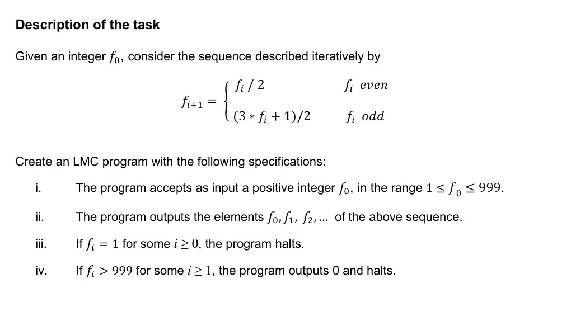

# LMC Web Application - Accelerated Testing Platform

A Django-based web application that revolutionized testing for Little Man Computer (LMC) assignments in our Computer Systems module. This project transformed a 30-second to 2-hour testing process into a **couple of seconds**, providing comprehensive testing for inputs 0-999.

-----

## 🎯 Project Overview

This web application was developed to support students in our Computer Systems module's LMC assignment, which was worth **17% of the module's final mark**. The traditional LMC simulator provided by the university was a **visual program** that animated the fetch-decode-execute cycle and displayed memory mailboxes. This visual nature made comprehensive testing extremely slow and created a significant bottleneck for students trying to validate their programs thoroughly. We were capped at 100 instructions (mailboxes), and part of our grade was based on using as little memory as possible.

The assignment, titled "LMC programming assignment," was for my **COMP1071 Computer Systems** module at **Durham University** in the 2024-25 academic year. Students were required to submit an LMC assembly code file written in the LMC assembly language. 



### The Problem

  - **Manual Testing**: Students had to manually input test cases one by one.
  - **Time Consuming**: Testing all necessary inputs (0-999) took 30 seconds to 2 hours depending on the input.
  - **Limited Coverage**: Due to time constraints, students often tested only a few cases instead of comprehensive edge cases.
  - **Inefficient Workflow**: No easy way to batch test or compare results.

### The Solution

A collaborative effort that combined:

1.  **High-Performance LMC Emulator**: A classmate developed a complete LMC emulator in C for maximum speed.
2.  **Multi-threaded Python Interface**: Python scripts utilizing threading to run multiple test cases simultaneously.
3.  **Web-Based Frontend**: Django application providing easy file upload and result visualization.
4.  **Campus Network Deployment**: Hosted locally on university network for student access.

-----

## 🚀 Performance Impact

  - **Speed Improvement**: From 2+ hours → **2-3 seconds**.
  - **Test Coverage**: Complete testing of inputs 0-999 (all possible 3-digit inputs).
  - **Accessibility**: Multiple students could test simultaneously via a web interface.
  - **Result Analysis**: Detailed pass/fail reporting with expected vs. actual output comparison.

-----

## 🏗️ Technical Architecture

### Core Components

  - **Django Web Framework**: Handles file uploads, test execution, and result display.
  - **C-based LMC Emulator**: High-performance LMC instruction execution.
  - **ThreadPoolExecutor**: Concurrent test execution across multiple inputs.
  - **SQLite Database**: Stores performance rankings and test results.

### Key Features

  - **File Upload Interface**: Students upload their `.lmc` files through a web form.
  - **Comprehensive Testing**: Automatically tests all inputs from 1-999.
  - **Real-time Results**: Displays pass/fail status, execution time, and detailed output comparison.
  - **Performance Leaderboard**: Tracks fastest execution times and memory efficiency.
  - **Error Analysis**: Shows exact differences between expected and actual outputs.

-----

## 📊 Testing Methodology

The application tests LMC programs using the Collatz Conjecture sequence as the benchmark:

  - Tests inputs from 1 to 999.
  - Compares actual output against pre-computed correct sequences.
  - Handles edge cases and boundary conditions.
  - Provides detailed failure analysis for debugging.

-----

## 🛠️ Installation & Setup

### Prerequisites

1.  Get the compiled LMC emulator by following the instructions here:
    [https://github.com/jdf18/LMC\_Emulator](https://github.com/jdf18/LMC_Emulator)

2.  Move the compiled LMC file (`LMCEmulator`) to the `lmc_app` directory.

### Installation Steps

1.  **Clone the repository**

    ```bash
    git clone https://github.com/AMuh2020/lmc_webapp.git
    cd lmc_webapp
    ```

2.  **Set up Python environment** (optional but recommended)

    ```bash
    python3 -m venv venv
    source venv/bin/activate  # On macOS/Linux
    ```

3.  **Install dependencies**

    ```bash
    pip install django
    ```

4.  **Run database migrations**

    ```bash
    python3 manage.py migrate
    ```

5.  **Start the development server**

    ```bash
    python3 manage.py runserver
    ```

6.  **Access the application**
    Navigate to the link provided by the server (typically `http://127.0.0.1:8000/`)

-----

## 📁 Project Structure

```
lmc_webapp/
├── db.sqlite3              # Database file
├── manage.py              # Django management script
├── readme.md              # This file
├── lmc_app/               # Main application
│   ├── LMCEmulator        # Compiled LMC emulator binary
│   ├── collatz.json       # Test data (expected outputs)
│   ├── models.py          # Database models
│   ├── views.py           # Web request handlers
│   ├── run.py             # Core testing logic with threading
│   ├── urls.py            # URL routing
│   ├── templates/         # HTML templates
│   └── migrations/        # Database migrations
└── lmc_ranking/           # Django project settings
    ├── settings.py        # Configuration
    ├── urls.py            # Main URL configuration
    └── wsgi.py            # WSGI configuration
```
-----

## 💡 What I Learned

This project was a significant learning experience that went beyond just building a web app. The core of my learning came from diving into the C code written by my classmate. By reading their complete LMC emulator, I gained a much deeper understanding of C programming, particularly the concepts of **state machines** and the intricacies of **variable management**. I was even able to contribute to the project by identifying and correcting a small error in their code.

Furthermore, this project demystified the **compilation process** on Windows for me, teaching me what an **executable** is and how it can be executed and integrated with other programming languages, specifically Python. It was incredibly rewarding to finally apply my web development skills in a very direct and meaningful way, creating a tool that provided tangible help to over 30 of my classmates, drastically improving their workflow and reducing their stress during the assignment.

-----

## 🙌 Acknowledgments and Collaboration

This project's speed and effectiveness would not have been possible without the crucial contributions of a fellow student, **[jdf18](https://github.com/jdf18/)**. They undertook the significant task of writing a **complete, high-performance LMC emulator in C** and the multi-threaded Python script to interface with it. This provided the essential backend engine that allowed for such a dramatic improvement in testing speed. My work on the Django web application was built directly on top of their outstanding and foundational work. Their intellectual effort and contribution were instrumental to the success of this project.

-----

## A Note on Academic Integrity

While this tool proved immensely helpful, it's worth noting that it may have circumvented a key learning objective of the assignment. A core part of the marking criteria was the student's ability to **identify and test for edge cases and boundary conditions** on their own. By automatically testing all inputs from 0-999, the application did this work for the student, potentially reducing the need for manual, critical thought about the program's vulnerabilities. The tool's primary purpose was to provide rapid feedback and aid in debugging, but its comprehensive nature could be seen as an academic shortcut in the context of the module's intended learning outcomes.

-----

## 🎓 Educational Impact

This project significantly improved the learning experience for Computer Systems students by:

  - **Eliminating Testing Bottlenecks**: Students could focus on algorithm development rather than manual testing.
  - **Encouraging Comprehensive Testing**: Made it practical to test edge cases and boundary conditions.
  - **Facilitating Collaboration**: Shared testing platform reduced individual setup overhead.
  - **Performance Awareness**: Leaderboard encouraged optimization and efficient code writing.
  - **Debugging Support**: Detailed output comparison helped identify specific logic errors.

-----

## 🔧 Technical Highlights

  - **Concurrent Processing**: `ThreadPoolExecutor` enables parallel test execution.
  - **Cross-Platform Support**: Handles both Windows and Unix environments.
  - **Memory Management**: Automatic cleanup of temporary files.
  - **Robust Error Handling**: Graceful handling of invalid inputs and execution errors.
  - **Scalable Architecture**: Can handle multiple simultaneous users.

-----

## 🏆 Results & Recognition

The application successfully served the entire class during the assignment period, providing:

  - **Faster Development Cycles**: Students could iterate and improve their code much more rapidly.
  - **Higher Quality Submissions**: Comprehensive testing led to more robust LMC programs.
  - **Reduced Stress**: Eliminated uncertainty about program correctness before submission.
  - **Collaborative Learning**: Students could easily share and compare performance metrics.

-----

*This project demonstrates how thoughtful application of software engineering principles can dramatically improve educational workflows and student outcomes in computer science education.*